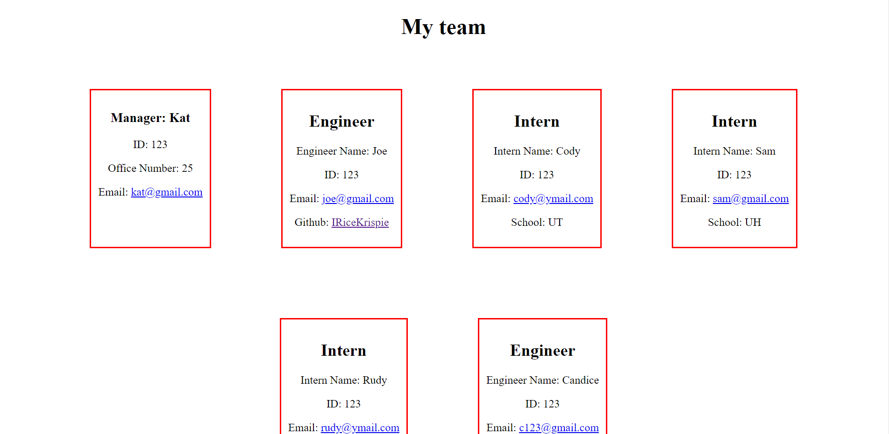

# OOP-challenge
Module 10 challenge

## About
* This app lets you create a portfolio for your team
* The app takes in user input using inquierer to fill out info about interns and engineers
* You can add as many interns and engineers to your team
* The web page is then created
* You can run tests to ensure each class is created correctly

## Links
* Github: https://github.com/IRiceKrispie/OOP-challenge
* Video: https://www.youtube.com/watch?v=ZZ7-3Bsd75o

## Screenshots

